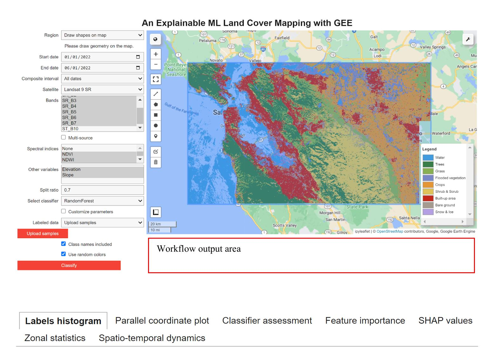
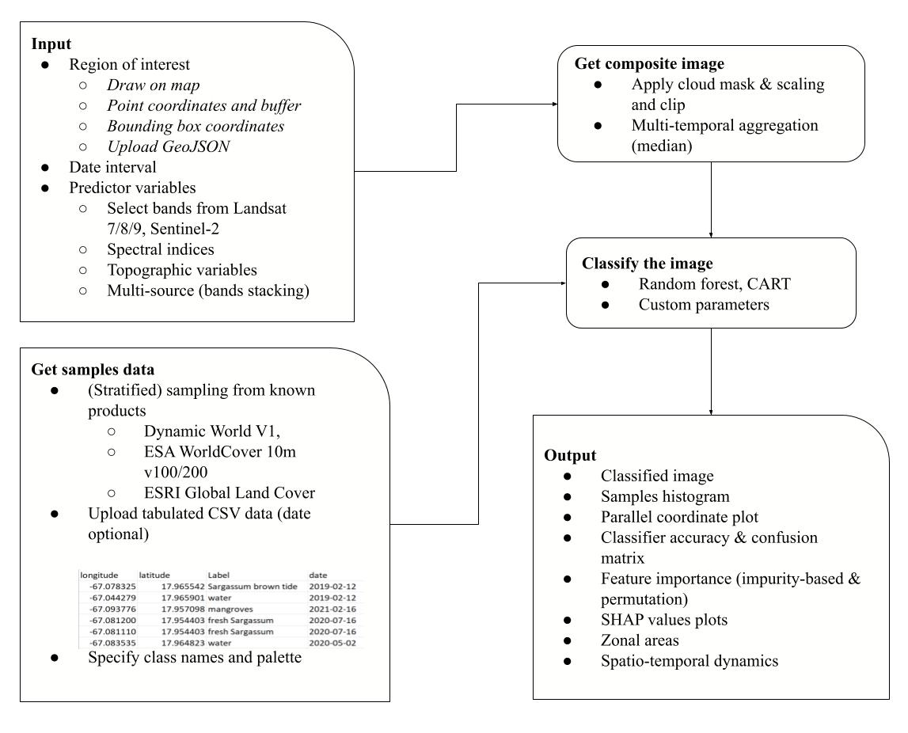

# XAI-tool4GEE

This is the repository for the paper titled, "Enhancing Land Cover Mapping and Monitoring: An Interactive and Explainable Machine Learning Approach using Google Earth Engine".

[Chen, H.; Yang, L.; Wu, Q. Enhancing Land Cover Mapping and Monitoring: An Interactive and Explainable Machine Learning Approach Using Google Earth Engine. 
Remote Sens. 2023, 15, 4585. https://doi.org/10.3390/rs15184585](https://www.mdpi.com/2072-4292/15/18/4585)

# Examples

<a href="https://github.com/GeoAIR-lab/XAI-tool4GEE/blob/main/examples/Google_sample/example_output_google_samples.ipynb">Example notebook output</a>

https://github.com/GeoAIR-lab/XAI-tool4GEE/assets/85247999/290928b6-cf3a-4626-a574-ba4a63e45559

<a href="https://github.com/GeoAIR-lab/XAI-tool4GEE/blob/main/examples/Esri/example_output_sample_esri.ipynb">Example notebook output</a>

https://github.com/GeoAIR-lab/XAI-tool4GEE/assets/85247999/a2d804de-4481-431e-a0d3-90b525c57cf6

<a href="https://github.com/GeoAIR-lab/XAI-tool4GEE/blob/main/examples/Dubai/example_output_Dubai.ipynb">Example notebook output</a>

https://github.com/GeoAIR-lab/XAI-tool4GEE/assets/85247999/22524d99-d0b0-4796-9fcf-6532ec3706e5

